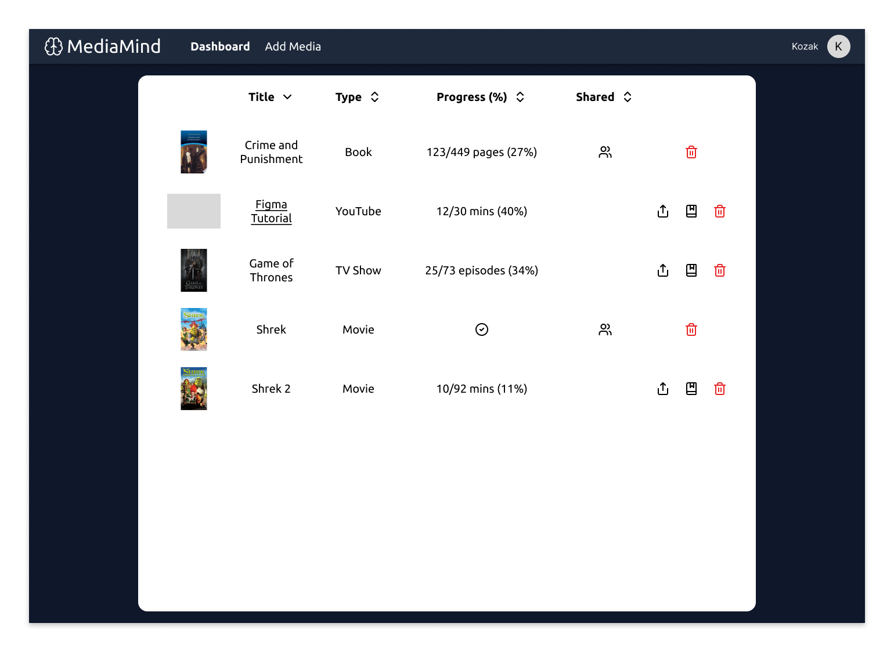

# Entertainment Tracker
## A rendszer céljai és nem céljai
Cél, hogy a projekt segítsen a szórakoztató médiák fogyasztásának a felhasználó általi követésében, hogy ne kelljen több különböző oldalt használni, amelyek nem is erre a célra lettek elkészítve. 
Nem cél, hogy az előrehaladás követése automatikusan történjen, ezt a felhasználónak saját magának kell, hogy kövesse. Nem cél az sem, hogy ezekhez a művekhez a rendszer automatikusan szolgáltasson metaadatot.

## [Jelenlegi helyzet](https://github.com/BlokOfWood/EntertainmentTracker/blob/main/kovspec.md#jelenlegi-helyzet)

## [Vágyálom rendszer](https://github.com/BlokOfWood/EntertainmentTracker/blob/main/kovspec.md#v%C3%A1gy%C3%A1lom-rendszer)

## [Rendszerre vonatkozó törvények, szabványok, ajánlások](https://github.com/BlokOfWood/EntertainmentTracker/blob/main/kovspec.md#rendszerre-vonatkoz%C3%B3-t%C3%B6rv%C3%A9nyek-szabv%C3%A1nyok-aj%C3%A1nl%C3%A1sok)

## [Követelménylista](https://github.com/BlokOfWood/EntertainmentTracker/blob/main/kovspec.md#k%C3%B6vetelm%C3%A9nylista)

## Használati esetek

Regisztráció/belépés:

Új mű hozzáadása, mű szerkesztése, mű törlése, mű megosztása:

### Első indítás
- leírás: a felhasználó első alkalommal elindítja a rendszert, a rendszer inicializálja a működés feltételeit
- előfeltételek: az aktuális indítás a rendszer első indítása
- utófeltételek: a rendszer készen áll a további működésre
- egyéb: létrehozza a helyi adatbázist
### Új mű hozzáadása
- leírás: a felhasználó a rendszerben még nem szereplő művet vesz fel, a rendszer hozzáadja az új művet
- előfeltételek: a mű még nem szerepel a rendszerben, az első indítás megtörtént
- utófeltételek: a rendszerben tárolásra került az új mű
- egyéb: a mű hozzáadás után megtekinthető
### Meglévő mű szerkesztése
- leírás: a felhasználó a rendszerben már szereplő műről tárolt adatokat frissíti, a rendszer frissíti a mű adatait
- előfeltételek: a mű már létezik a rendszerben
- utófeltételek: a rendszer a művet a frissített adatokkal tárolja
- egyéb: a mű a frissített adatokkal megtekinthető
### Meglévő mű törlése
- leírás: a felhasználó a rendszerben már szereplő művet töröl, a rendszer eltávolítja a művet és a róla tárolt adatokat
- előfeltételek: a mű már létezik a rendszerben
- utófeltételek: a rendszer nem tárolja a művet
- egyéb: a mű többé nem megtekinthető
### Művek megtekintése
- leírás: a felhasználó megtekinti a rendszerben tárolt műveket
- előfeltételek: az első indítás megtörtént
- egyéb: az összes tárolt mű megtekinthető
### Művek szűrése
- leírás: a felhasználó a tárolt művek között szűr, a rendszer csak a szűrésnek megfelelő műveket jeleníti meg
- előfeltételek: az első indítás megtörtént

## Megfeleltetés
|Használati Esetek|Követelmény ID|
|:----------------|:--------------|
|Első indítás|K9|
|Új mű hozzáadása|K2, K6, K9|
|Meglévő mű szerkesztése|K2, K4, K7, K9|
|Meglévő mű törlése|K5, K8, K9|
|Művek megtekíntése|K1|
|Művek szűrése|K3|

## Képernyő tervek

### Register Page
Felhasználó új fiókot tud megadni, e-mail cím, felhasználónév és jelszó megadásával majd a 'Register' gombra kattintva.

### Login Page
Már regisztrált felhasználó be tud jelentkezni e-mail címmel és jelszóval.

### Navbar Component
A felhasználó a navigációs sáv Dashboard gombjára kattintva megtekintheti a Dashboard-ot, Add Media gombbal új művet tud hozzáadni, valamint profilképére mozdítva a kurzort, a Logout-ra kattintva pedig ki tud lépni.

### Dashboard
A felhasználó meg tudja tekinteni a hozzáadott műveket, ezeket tudja szerkeszteni a ceruza ikonra vagy törölni a piros szemetesláda ikonra kattintva, vagy meg tudja osztani másik felhasználóval.
A felhasználó a Title, Type és Progress fejléc elemekkel tudja változtatni a tárolt művek megjelenítési sorrendjét.

### Share with Friend
E-mail cím megadásával meg oszthatja a felhasználó egy másik felhasználóval a haladását egy médiában.

### Add Media
A felhasználó az Add Media oldalon tudja kiválasztani milyen médiatípust szeretne hozzáadni - könyvet, sorozatot, filmet, YouTube videót.

#### Add Content - Component

Add Media - Books: a felhasználó cím vagy ISBN azonosítóval tud keresni az ISBN adatbázisban és a találatok közül tud felvenni a követett művei közé könyvet.

Add Media - TV Shows: a felhasználó cím vagy IMBDb azonosítóval tud keresni az IMDb adatbázisban és a találatok közül tud felvenni a követett művei közé sorozatot.

Add Media - Movies: a felhasználó cím vagy IMBDb azonosítóval tud keresni az IMDb adatbázisban és a találatok közül tud felvenni a követett művei közé filmet.

Add Media - YouTube: a felhasználó URL-el és megjelenítési név megadásával tud hozzáadni YouTube videót a követett műveihez.

### Edit Media

Edit Media - Books: A felhasználó frissíteni tudja hanyadik oldalon tart a könyvben.

Edit Media - TV Shows: A felhasználó frissíeni tudja hanyadik epizódnál tart a sorozatban.

Edit Media - Movies: A felhasználó frissíteni tudja hanyadik percnél tart a filmben.

Edit Media - YouTube: A felhasználó meg tudja változtatni a videó követett művei közötti megjelenítési nevét.

## Forgatókönyvek
- Haladását módosítja egy adott műben a felhasználó: mű melletti szerkesztés gomb -> módosítás ablak -> átírja a haladást -> mentés
- Új mű hozzáadása: új mű gomb -> új mű ablak -> kitölti az űrlapot -> mentés gomb
- Mű szerkesztése: adott művön szerkesztés gomb -> mű szerkesztés ablak -> átírja amit szeretne -> mentés gomb
- Mű törlése: mű törlése gomb -> törlés megerősítés felugró ablak -> megerősítés gomb
- Művek szűrése: adott kategória szűrő mező -> szűrési minta beírása
