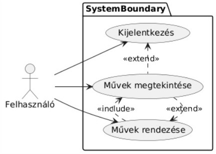
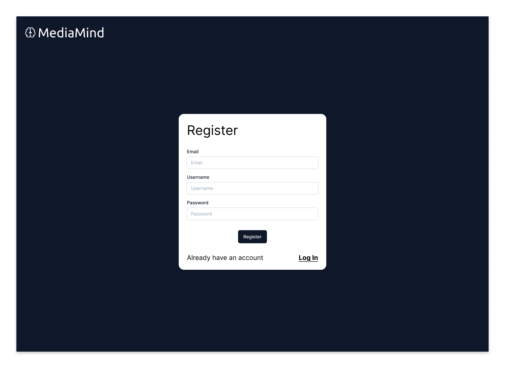
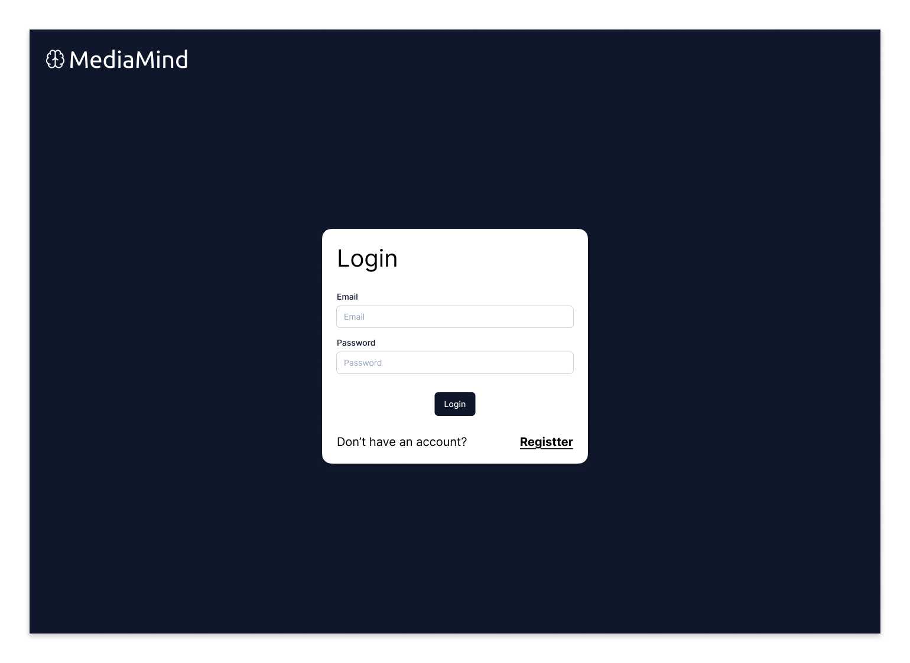
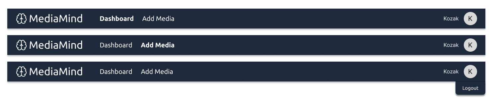

# Entertainment Tracker
## A rendszer céljai és nem céljai
Cél, hogy a projekt segítsen a szórakoztató médiák fogyasztásának a felhasználó általi követésében, hogy ne kelljen több különböző oldalt használni, amelyek nem is erre a célra lettek elkészítve.  Cél az is, hogy az adott művekhez a metaadatot a rendszer automatikusan szerezze és a felhasználó eszközei között az adatok szinkronizálása.
Nem cél, hogy az előrehaladás követése automatikusan történjen, ezt a felhasználónak saját magának kell, hogy kövesse.

## [Jelenlegi helyzet](https://github.com/BlokOfWood/EntertainmentTracker/blob/main/kovspec.md#jelenlegi-helyzet)

## [Vágyálom rendszer](https://github.com/BlokOfWood/EntertainmentTracker/blob/main/kovspec.md#v%C3%A1gy%C3%A1lom-rendszer)

## [Rendszerre vonatkozó törvények, szabványok, ajánlások](https://github.com/BlokOfWood/EntertainmentTracker/blob/main/kovspec.md#rendszerre-vonatkoz%C3%B3-t%C3%B6rv%C3%A9nyek-szabv%C3%A1nyok-aj%C3%A1nl%C3%A1sok)

## [Követelménylista](https://github.com/BlokOfWood/EntertainmentTracker/blob/main/kovspec.md#k%C3%B6vetelm%C3%A9nylista)

## Használati esetek

Regisztráció/belépés:

Új mű hozzáadása, mű szerkesztése, mű törlése, mű megosztása:

Művek megtekintése, művek rendezése, kijelentkezés:

### Regisztáció
- leírás: a felhasználó felveszi magát mint új még nem szereplő elem a rendszerben
- előfeltételek: a felhasználó még nem szerepel a rendszerben
- utófeltételek: a felhasználó képes bejelentkezni a létrehozott fiókba
### Bejelentkezés
- leírás: a felhasználó azonosítja magát mint egy meglévő elem a rendszerben
- előfeltételek: a felhasználó szerepel a rendszerben
- utófeltételek: a felhasználó hozzáférést kap az adott fiókhoz
- egyéb: a felhasználó megtekíntheti a nyomonkövetett műveket és módosíthatja azokat
### Kijelentkezés
- leírás: a felhasználó kijelentkezik a rendszerből
- előfeltételek: a felhasználó be van jelentkezve
- utófeltételek: a felhasználó ha a fiókhoz hozzá szeretne férni, újra be kell jelentkeznie
- egyéb: a felhasználó visszakerül a bejelentkezés felületre
### Új mű hozzáadása
- leírás: a felhasználó a rendszerben még nem szereplő művet vesz fel, a rendszer hozzáadja az új művet
- előfeltételek: a mű még nem szerepel a rendszerben, a felhasználó bejelentkezve van
- utófeltételek: a rendszerben tárolásra került az új mű
- egyéb: a mű hozzáadás után megtekinthető
### Meglévő mű szerkesztése
- leírás: a felhasználó a rendszerben már szereplő műről tárolt adatokat frissíti, a rendszer frissíti a mű adatait
- előfeltételek: a mű már létezik a rendszerben, a felhasználó bejelentkezve van
- utófeltételek: a rendszer a művet a frissített adatokkal tárolja
- egyéb: a mű a frissített adatokkal megtekinthető
### Meglévő mű törlése
- leírás: a felhasználó a rendszerben már szereplő művet töröl, a rendszer eltávolítja a művet és a róla tárolt adatokat
- előfeltételek: a mű már létezik a rendszerben, a felhasználó bejelentkezve van
- utófeltételek: a rendszer nem tárolja a művet
- egyéb: a mű többé nem megtekinthető
### Művek megtekintése
- leírás: a felhasználó megtekinti a rendszerben tárolt műveket
- előfeltételek: a felhasználó bejelentkezve van
- egyéb: az összes tárolt mű megtekinthető
### Művek rendezése
- leírás: a felhasználó a tárolt műveket rendezi növekvő/csökkenő/eredeti sorrendbe, a rendszer a rendezésnek megfelelően jeleníti meg a műveket
- előfeltételek: a felhasználó bejelentkezve van
### Mű megosztása
- leírás: a felhasználó a tárolt műveket más felhasználókkal meg tudja osztani
- előfeltételek: a felhasználó be van jelentkezve és létezik a másik felhasználó

## Megfeleltetés
|Használati Esetek|Követelmény ID|
|:----------------|:--------------|
|Regisztráció|K10|
|Bejelentkezés|K11|
|Kijelentkezés|K14|
|Új mű hozzáadása|K2, K6, K9|
|Meglévő mű szerkesztése|K2, K4, K7, K9|
|Meglévő mű törlése|K5, K8, K9|
|Művek megtekíntése|K1,K12|
|Művek rendezése|K3|
|Mű megosztása|K13|

## Képernyő tervek

### Register Page
Felhasználó új fiókot tud létrehozni, e-mail cím, felhasználónév és jelszó megadásával, majd a 'Register' gombra kattintva létrejön a felhasználói fiók.

### Login Page
Már regisztrált felhasználó be tud jelentkezni e-mail címmel és jelszóval.

### Navbar Component
A felhasználó a navigációs sáv Dashboard gombjára kattintva megtekintheti a Dashboard-ot, Add Media gombbal új művet tud hozzáadni, valamint profilképére mozdítva a kurzort és a Logout-ra kattintva pedig ki tud lépni fiókjából.

### Dashboard
A felhasználó meg tudja tekinteni a hozzáadott műveket, ezeket tudja szerkeszteni a könyvjelző ikonnal, törölni a piros szemetesláda ikonnal, vagy meg tudja osztani másik felhasználóval a megosztás ikonnal. A felhasználó a vele megosztott művet tudja törölni (a megosztást visszavonni) a piros szemetesláda ikonnal, olyan műnél, ami vele megosztásra került (ezt jelzi a kis emberke ikon a 'Shared' oszlopban).
A felhasználó a Title, Type, Progress és Shared fejléc elemekkel tudja változtatni a tárolt művek megjelenítési sorrendjét.

### Share with Friend
E-mail cím megadásával meg oszthatja a felhasználó egy másik felhasználóval a haladását egy médiában.

### Add Media
A felhasználó az Add Media oldalon tudja kiválasztani milyen médiatípust szeretne hozzáadni - könyvet, sorozatot, filmet, YouTube videót.

#### Add Content - Component

Add Media - Books: a felhasználó cím vagy ISBN azonosítóval tud keresni a Google Books adatbázisban és a találatok közül tud felvenni a követett művei közé könyvet.

Add Media - Movies: a felhasználó cím vagy IMBDb azonosítóval tud keresni az TMDB adatbázisban és a találatok közül tud felvenni a követett művei közé filmet.

Add Media - TV Shows: a felhasználó cím vagy IMBDb azonosítóval tud keresni az TMDB adatbázisban és a találatok közül tud felvenni a követett művei közé sorozatot.

Add Media - YouTube: a felhasználó URL-el és megjelenítési név megadásával tud hozzáadni YouTube videót a követett műveihez.

### Edit Media

Edit Media - Books: A felhasználó frissíteni tudja hanyadik oldalon tart a könyvben.

Edit Media - TV Shows: A felhasználó frissíeni tudja hanyadik epizódnál tart a sorozatban.

Edit Media - Movies: A felhasználó frissíteni tudja hanyadik percnél tart a filmben.

Edit Media - YouTube: A felhasználó meg tudja változtatni a videó követett művei közötti megjelenítési nevét.

Delete Confirmation: A felhasználónak a törlés gomb megnyomása után válaszolnia kell a törlés megerősítés dialógusra, hogy végbe menjen egy mű törlése.

## Forgatókönyvek
- Haladását módosítja egy adott műben a felhasználó: mű melletti szerkesztés gomb -> módosítás ablak -> átírja a haladást -> mentés
- Új mű hozzáadása: új mű gomb -> új mű ablak -> kitölti az űrlapot -> mentés gomb
- Mű szerkesztése: adott művön szerkesztés gomb -> mű szerkesztés ablak -> átírja amit szeretne -> mentés gomb
- Mű törlése: mű törlése gomb -> törlés megerősítés felugró ablak -> megerősítés gomb
- Művek rendezése: megfelelő fejlécmező kattintás -> művek rendezési sorrendjének változása
- Regsiztáció: email cím megadása -> felhasználó név megadása -> jelszó megadása -> regisztráció gomb megnyomása
- Bejelentkezés: felhasználó név megadása -> jelszó megadása -> bejelentkezés gomb megnyomása
- Kijelentkezés: jobb felül profil gomb -> kijelentkezés gomb
- Mű megosztása: megosztás gomb művön -> megadása a felhasználó email címének akivel megosztjuk a művet -> megosztás gomb
