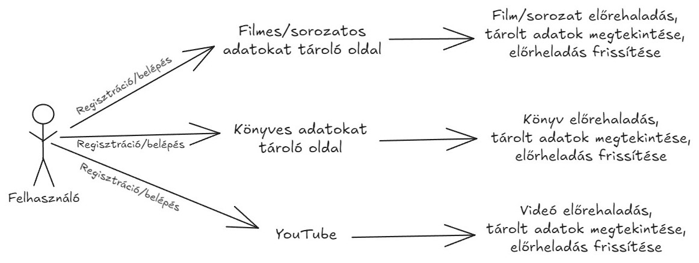
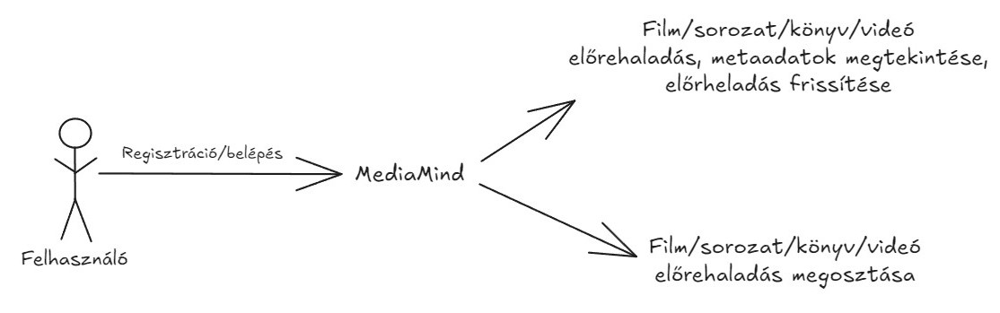
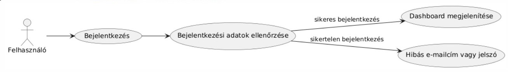
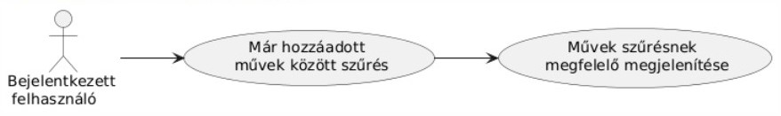
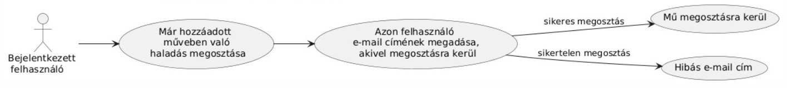
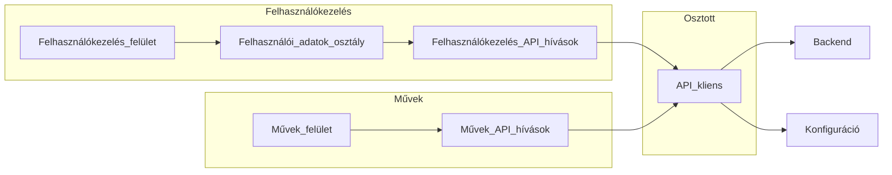
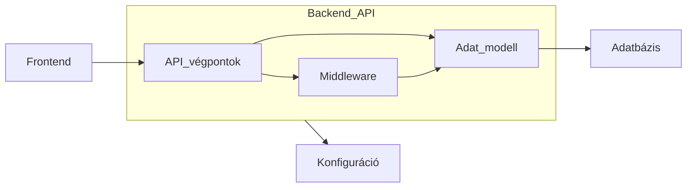
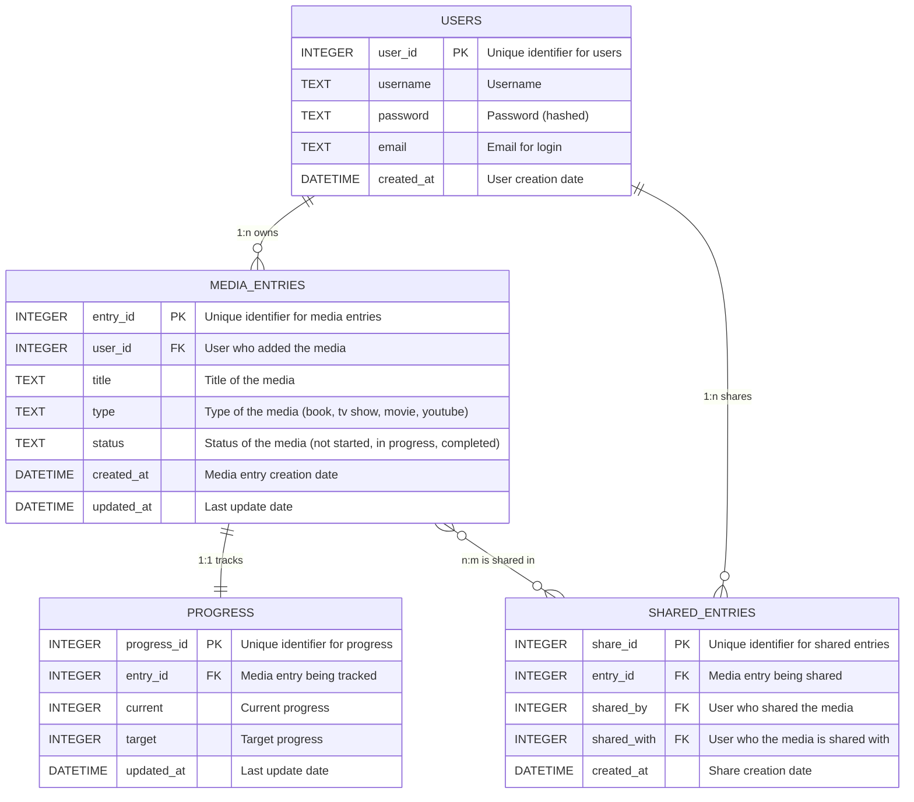

# Entertainment Tracker

## [Rendszer céljai és nemcéljai](https://github.com/BlokOfWood/EntertainmentTracker/blob/main/funkspec.md#a-rendszer-céljai-és-nem-céljai)

## Projekt terv
### Projekt munkások
- Kozák Bálint: backend fejlesztő, web designer
- Pap Sándor Dániel: frontend fejlesztő, scrum master
- Szász Hanna Rebeka: frontend fejlesztő, jegyző
### Projekt szerepkörök
- Backend fejlesztő: A backend architektúra fejlesztéséért felelős, pl. adatbázis-tervezés, API tervezés.
- Web designer: A weboldalak kinézetének megtervezéséért felelős, pl. képernyőtervek megvalósítása.
- Frontend fejlesztő: A frontend megvalósításáért felelős, pl. a képernyőtervek implementációja a weboldalon, a UX kialakítása.
- Scrum master: A csapat irányításáért és a terméktulajdonossal való kommunikációért felelős.
- Jegyző: A meeting-ek jegyzeteléséért és a projektre vonatkozó információk gyűjtéséért felelős.
### Ütemterv és mérföldkövek
#### Sprint 1 - Fejlesztés
- Felhasználókezelés (Bejelentkezés, Regisztráció, Kijelentkezés, Felhasználó-specifikus adatok)
- Művek megjelenítése tábla
- Backend: Művek módosítása, törlése, létrehozása endpoint
#### Sprint 2 - Fejlesztés
- Művek módosítása, törlése
- Művek hozzáadása third party api-ok alapján
- Művek szűrése
Mérföldkő: A rendszer funkcionális, használható és tesztelhető.
#### Sprint 3 - Fejlesztés
- Demós visszajelzés feldolgozása, észrevételek megfontolása
#### Sprint 4 - Tesztelés
- Frontend/backend önálló áttesztelése, unit tesztek írása
#### Sprint 5 - Tesztelés
- Integrációs tesztelés, felhasználói szemszögből ellenőrzése a rendszernek
Mérföldkő: A rendszer kész állapotba jut.

## Üzleti folyamatok modellje

Kiváltandó üzleti folyamatok modellje:

MediaMind üzleti folyamatainak modellje:

## Követelmények
|Modul|ID|Név|v. |Kifejtés|
|:----|:-|:--|:--|:-------|
|Felület|K1|Mű táblázat|1.0|A felület, amelyen az összes követett mű kijelzésre kerül.|
|Felület|K2|Mű hozzáadás/módosítás ablak|1.0|A felület, amelyen új követett művet lehet felvenni vagy módosítani egy meglévőt.|
|Felület|K3|Művek szűrése|1.0|Lehessen szűrni a műveket a név és állapot alapján.|
|Felület|K4|Mű előrehaladás kezelése|1.0|A különböző típusú művekkel az előrehaladást típusnak megfelelően lehet követni. Például: Könyvnél lap szám/max lapszám, filmnél idő/max idő|
|Felület|K5|Mű törlése megerősítése|1.0|A törlés megerősítésére szolgáló felugró ablak.|
|Modifikáció|K6|Mű felvétele|1.0|A felhasználó fel tudjon venni egy új művet.|
|Modifikáció|K7|Mű módosítása|1.0|A felhasználó egy meglévő művön tudja módosítani a nevet, állapotot és előrehaladást a művel.|
|Modifikáció|K8|Mű törlése|1.0|A felhasználó egy meglévő művet töröl a rendszerből.|
|Perziesztencia|K9|Művek perzisztenciája|1.0|Művek tárolása a rendszer indítások között.|
|Felhasználó kezelés|K10|Felhasználó regisztráció|1.0|Egy regisztrálatlan felhasználó fel tudja magát venni a rendszerbe.|
|Felhasználó kezelés|K11|Felhasználó bejelentkezés|1.0|Egy regisztrált felhasználó be tud jelentkezni a rendszerbe.|
|Felület|K12|Metaadat letöltése|1.0|A felhasználó láthat külső forrásból információkat anélkül, hogy meg kell adnia.|
|Felhasználó kezelés|K13|Bejegyzés megosztása másik felhasználóval|1.0|Egy felhasználó meg tud osztani egy saját bejegyzést egy másik felhasználóval.|
|Felhasználó kezelés|K14|A felhasználó kijelentkeztetése a rendszerből|1.0|Egy bejelentkezett felhasználó kijelentkezik a rendszerből.|
|Törvényi megfelelés|K15|GDPR megfelelés|1.0|A rendszer nem tárolhat a GDPR által személyes adatnak minősíthető információt.|
|Felület|K16|Regisztrációs oldal|1.0|A felület, amelyen a felhasználó regisztrálhatja magát a rendszerbe.|
|Felület|K17|Bejelentkezési oldal|1.0|A felület, amelyen a felhasználó bejelentkezhet a rendszerbe.|

## Funkcionális terv

Rendszerszereplők:

- felhasználó

Rendszerhasználati esetek és lefutásaik:

- új felhasználó regisztrál a rendszerbe

- már regisztrált felhasználó bejelentkezik a rendszerbe

- bejelentkezett felhasználó kijelentkezik a rendszerből

- bejelentkezett felhasználó új művet ad hozzá a tárolt műveihez

- bejelentekezett felhasználó már meglévő művet szerkeszt

- bejelentkezett felhasználó meglévő művet töröl

- bejelentkezett felhasználó megtekinti a mentett műveket

- bejelentkezett felhasználó szűr a mentett művek között

- bejelentkezett felhasználó műben való haladást oszt meg

Menü-hierarchiák:

- Navbar:
  - művek megtekintése
  - új mű hozzáadása
  - kijelentkezés
- Dashboard:
  - mentett művek megtekintése
  - szűrés mentett művek között
  - műben való haladás megosztása
  - mű szerkesztése
  - mű törlése
- Add Media:
  - könyv hozzáadása
  - sorozat hozzáadása
  - film hozzáadása
  - YouTube video hozzáadása
- Books:
  - könyv keresése cím, ISBN azonosító alapján
  - találatok közüli könyv hozzáadása
- TV Shows:
  - sorozat keresése cím, IMDb ID alapján
  - találatok közüli könyv hozzáadása
- Movies:
  - film keresése cím, IMDb ID alapján
  - találatok közüli könyv hozzáadása
- YouTube:
  - megjelenítési név megadása
  - YouTube URL megadása

## Fizikai környezet
Fizikai környezet szempontjából a rendzser két részre bontható.
### Frontend
A frontend a felület amelyen keresztül a rendszer funkciói elérhetőek lesznek a felhasználó számára. Ez egy weboldal lesz, amely a Svelte keretrendszert fogja használni a felület megvalósításához a Vite frontend build szoftverrel. A weboldal kinézetének fejlesztéséhez a Tailwind CSS keretrendszert fogjuk használni. Mivel fordítás után a végtermék rendes html, css és javascript fájlok a felület elérhetővé tevése bármilyen web szerverrel lehetséges. **megbeszélni milyen webszerver**
### Backend
A backend a szerver amelyen keresztül a frontend képes lesz ellátni funkcióit. Alapvetően egy Go nyelven írt REST API, amely a funkcióit alapvetően a **bálint tudja** framework-kel látja el. Az adattároláshoz az SQLite beépített adatbázis könyvtárat használja, mely azt jelenti, hogy külön adatbázis szervert nem lesz szükséges fenntartani. Több külső API-t használni fog: a filmek és tv sorozatok metaadat szerzéséhez az IMDb API-t, a YouTube videók metaadat szerzéséhez a YouTube API-t és a könyvek metaadat szerzéséhez a **bálint tudja** API-t.
 
## Architekturális terv
### Frontend
A frontend egy Svelteben írt weboldal mely a következő komponensekből áll:
- Felhasználókezelés: Ide tartozik a bejelentkezés és regisztrációs oldalak, a felhasználói adatokat kezelő osztály és a felhasználói adatokkal kapcsolatos backend kéréseket végző függvények.
- Művek: Ide tartozik a művek tábla, a mű módosítása/létrehozása ablak és az ezzel kapcsolatos backend kéréseket végző függvények.
- Megosztott: Ide tartozik minden olyan függvény amelyet a rendszer több része használ, például a backend kéréseket végző osztály.
- Konfiguráció: A frontend konfigurációs fájlja, amelyben megtalálható a backend szerver elérési útja.

### Backend
A backend egy Go nyelven írt REST API, amely a felhasználók és a mentett művek adatait kezeli. Az adatok egy SQLite adatbázisban tárolódnak. Az architektúra a következő komponensekből áll:
- API végpontok: Az egyes funkciókat megvalósító végpontok, például felhasználók regisztrálása, bejelentkezése, művek hozzáadása, szerkesztése, törlése.
- Adat modell: Az adatbázis tábláinak, kapcsolatainak leírása és a rajtuk végzett műveletek megvalósítása.
- Middleware: Az autentikációt és autorizációt végző middleware, amely biztosítja, hogy csak bejelentkezett felhasználók érhessék el a védett végpontokat.
- Adatbázis: Az SQLite adatbázis, amelyben a felhasználók és művek adatai tárolódnak.
- Konfiguráció: A backend konfigurációs fájlja, amelyben az adatbázis elérési útja, külső API kulcsok, stb. találhatók.

### Frontend
TODO

## Adatbázis terv

## Frontend tesztterv

A tesztelés célja a frontend megfelelő működésének vizsgálata.

A frontendnek a felület megnyitásakor a felhasználónak elérhetőve kell tenni a regisztráció vagy bejelentkezés opciót.
Bejelentkezés után a Dashboard-on a mentett műveknek megtekinhetőnek kell lenniük, köztük szűrni lehessen, új mű hozzáadásának vagy már létező mű szerkesztésének, törlésének lehetségesnek kell lenni.
A felhasználónak lehetősége kell legyen műben való haladást megosztani, megosztott műben való haladást megtekinteni.

Unit teszt:
A tesztelés fejlesztési idő alatt történik.
A megjelenített adatok pontosságának ellenőrzése, új mű hozzádása vagy már hozzáadott műveken végzett műveletek a megfelelő következményeket vonja maga után.
Megbizonyosodni a frontend komponenseinek jelenlétéről a megfelelő funkciókkal, megjelenéssel.
Komponensek és oldalak közötti útvonalak helyes működésének ellenőrzése.
Frontend metódusok megfelelő működésének ellenőrzése.

Alfa teszt:
Fejlesztők által végzett teszt. Elsődleges célja az rendszer működésének felhasználó szemszögéből való ellenőrzése.
A rendszer a fejlesztési folyamat alatt, valamint kész állapotában is tesztelésre kerül, esetlegesen felmerülő problémák észlelése, javítása miatt.

## Backend tesztterv

A tesztelés célja a backend megfelelő működésének és az adatkezelés pontosságának vizsgálata.

A backendnek biztosítania kell az adatbázis műveletek megfelelő végrehajtását, például művek hozzáadását, szerkesztését, törlését, a felhasználói hitelesítést, valamint a megosztott művek kezelését. A cél az API végpontok helyes működésének ellenőrzése, hogy a felhasználó be tudjon jelentkezni, regisztrálni tudjon, és a felhasználói műveletek a megfelelő adatbázis-frissítéseket eredményezzék. A backendnek a műveletek során fellépő hibák esetén is kezelnie kell a helyzetet, megfelelő hibaüzeneteket visszaadva.

### Unit teszt:
- **Cél:** Fejlesztési idő alatt történő részletes ellenőrzés az egyes API végpontok és adatkezelési logika helyességéről.
- **Tesztelendő területek:**
  - **Felhasználói hitelesítés:** Regisztráció és bejelentkezés végpontjainak tesztelése, helyes és helytelen adatokra adott válaszok ellenőrzése.
  - **CRUD műveletek művekhez:** Mű hozzáadásának, módosításának, törlésének tesztelése, ellenőrizve az adatbázis frissülését és a helyes válaszok visszaadását.
  - **Szűrés és lekérdezés:** Szűrési funkciók tesztelése különböző paraméterekkel (például név, státusz) a helyes találati eredmények biztosítására.
  - **Megosztási funkció:** Megosztott művek kezelésének tesztelése, művek megosztása és megtekintése, jogosultságok ellenőrzése.
  - **Adat integritás:** A backend biztosítja, hogy minden adatbázis-módosítás konzisztense legyen, például a törölt művek nem maradhatnak megosztva.
- **Módszer:** Minden végponthoz külön tesztesetek létrehozása, pozitív és negatív esetek lefuttatása, illetve adatbázis állapotok ellenőrzése.

### Alfa teszt:
- **Cél:** A backend működésének felhasználói szemszögből történő ellenőrzése, a rendszer teljes funkcionalitásának tesztelése.
- **Tesztelendő területek:**
  - **Felhasználói élmény:** A felhasználók számára elérhető funkciók helyes működésének ellenőrzése, például regisztráció, bejelentkezés, művek kezelése.
  - **Adatkezelés:** A felhasználói műveletek helyes hatásainak ellenőrzése az adatbázisban, például művek hozzáadása, szerkesztése, törlése.
  - **Hibakezelés:** A rendszer helyes hibaüzeneteket ad-e vissza, ha a felhasználó hibás adatokat ad meg vagy hibás műveleteket próbál végrehajtani.
- **Módszer:** Manuális tesztelés a rendszer teljes funkcionalitásának ellenőrzésére, különböző felhasználói szituációk szimulálása, hibás adatokkal való próbálkozás.

## Telepítési terv
### [Backend telepítési útmutató](backend/README.md)
