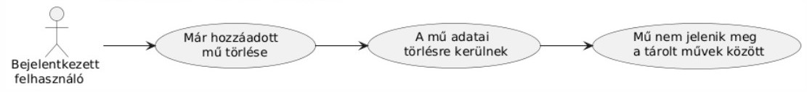

# Entertainment Tracker

## [Rendszer céljai és nemcéljai](https://github.com/BlokOfWood/EntertainmentTracker/blob/main/funkspec.md#a-rendszer-céljai-és-nem-céljai)

## Üzleti folyamatok modellje

Kiváltandó üzleti folyamatok modellje:

MediaMind üzleti folyamatainak modellje:

## Funkcionális terv

Rendszerszereplők:

- felhasználó

Rendszerhasználati esetek és lefutásaik:

- új felhasználó regisztrál a rendszerbe

- már regisztrált felhasználó bejelentkezik a rendszerbe

- bejelentkezett felhasználó kijelentkezik a rendszerből

- bejelentkezett felhasználó új művet ad hozzá a tárolt műveihez

- bejelentekezett felhasználó már meglévő művet szerkeszt

- bejelentkezett felhasználó meglévő művet töröl

- bejelentkezett felhasználó megtekinti a mentett műveket

- bejelentkezett felhasználó szűr a mentett művek között

- bejelentkezett felhasználó műben való haladást oszt meg

Menü-hierarchiák:

- Navbar:
  - művek megtekintése
  - új mű hozzáadása
  - kijelentkezés
- Dashboard:
  - mentett művek megtekintése
  - szűrés mentett művek között
  - műben való haladás megosztása
  - mű szerkesztése
  - mű törlése
- Add Media:
  - könyv hozzáadása
  - sorozat hozzáadása
  - film hozzáadása
  - YouTube video hozzáadása
- Books:
  - könyv keresése cím, ISBN azonosító alapján
  - találatok közüli könyv hozzáadása
- TV Shows:
  - sorozat keresése cím, IMDb ID alapján
  - találatok közüli könyv hozzáadása
- Movies:
  - film keresése cím, IMDb ID alapján
  - találatok közüli könyv hozzáadása
- YouTube:
  - megjelenítési név megadása
  - YouTube URL megadása

## Adatbázis terv

## Frontend tesztterv

A tesztelés célja a frontend megfelelő működésének vizsgálata.

A frontendnek a felület megnyitásakor a felhasználónak elérhetőve kell tenni a regisztráció vagy bejelentkezés opciót.
Bejelentkezés után a Dashboard-on a mentett műveknek megtekinhetőnek kell lenniük, köztük szűrni lehessen, új mű hozzáadásának vagy már létező mű szerkesztésének, törlésének lehetségesnek kell lenni.
A felhasználónak lehetősége kell legyen műben való haladást megosztani, megosztott műben való haladást megtekinteni.

Unit teszt:
A tesztelés fejlesztési idő alatt történik.
A megjelenített adatok pontosságának ellenőrzése, új mű hozzádása vagy már hozzáadott műveken végzett műveletek a megfelelő következményeket vonja maga után.
Megbizonyosodni a frontend komponenseinek jelenlétéről a megfelelő funkciókkal, megjelenéssel.
Komponensek és oldalak közötti útvonalak helyes működésének ellenőrzése.
Frontend metódusok megfelelő működésének ellenőrzése.

Alfa teszt:
Fejlesztők által végzett teszt. Elsődleges célja az rendszer működésének felhasználó szemszögéből való ellenőrzése.
A rendszer a fejlesztési folyamat alatt, valamint kész állapotában is tesztelésre kerül, esetlegesen felmerülő problémák észlelése, javítása miatt.

## Backend tesztterv

A tesztelés célja a backend megfelelő működésének és az adatkezelés pontosságának vizsgálata.

A backendnek biztosítania kell az adatbázis műveletek megfelelő végrehajtását, például művek hozzáadását, szerkesztését, törlését, a felhasználói hitelesítést, valamint a megosztott művek kezelését. A cél az API végpontok helyes működésének ellenőrzése, hogy a felhasználó be tudjon jelentkezni, regisztrálni tudjon, és a felhasználói műveletek a megfelelő adatbázis-frissítéseket eredményezzék. A backendnek a műveletek során fellépő hibák esetén is kezelnie kell a helyzetet, megfelelő hibaüzeneteket visszaadva.

### Unit teszt:
- **Cél:** Fejlesztési idő alatt történő részletes ellenőrzés az egyes API végpontok és adatkezelési logika helyességéről.
- **Tesztelendő területek:**
  - **Felhasználói hitelesítés:** Regisztráció és bejelentkezés végpontjainak tesztelése, helyes és helytelen adatokra adott válaszok ellenőrzése.
  - **CRUD műveletek művekhez:** Mű hozzáadásának, módosításának, törlésének tesztelése, ellenőrizve az adatbázis frissülését és a helyes válaszok visszaadását.
  - **Szűrés és lekérdezés:** Szűrési funkciók tesztelése különböző paraméterekkel (például név, státusz) a helyes találati eredmények biztosítására.
  - **Megosztási funkció:** Megosztott művek kezelésének tesztelése, művek megosztása és megtekintése, jogosultságok ellenőrzése.
  - **Adat integritás:** A backend biztosítja, hogy minden adatbázis-módosítás konzisztense legyen, például a törölt művek nem maradhatnak megosztva.
- **Módszer:** Minden végponthoz külön tesztesetek létrehozása, pozitív és negatív esetek lefuttatása, illetve adatbázis állapotok ellenőrzése.

### Alfa teszt:
- **Cél:** A backend működésének felhasználói szemszögből történő ellenőrzése, a rendszer teljes funkcionalitásának tesztelése.
- **Tesztelendő területek:**
  - **Felhasználói élmény:** A felhasználók számára elérhető funkciók helyes működésének ellenőrzése, például regisztráció, bejelentkezés, művek kezelése.
  - **Adatkezelés:** A felhasználói műveletek helyes hatásainak ellenőrzése az adatbázisban, például művek hozzáadása, szerkesztése, törlése.
  - **Hibakezelés:** A rendszer helyes hibaüzeneteket ad-e vissza, ha a felhasználó hibás adatokat ad meg vagy hibás műveleteket próbál végrehajtani.
- **Módszer:** Manuális tesztelés a rendszer teljes funkcionalitásának ellenőrzésére, különböző felhasználói szituációk szimulálása, hibás adatokkal való próbálkozás.
