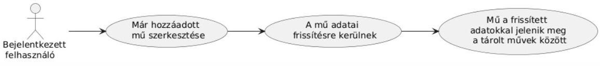
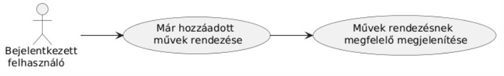

# Entertainment Tracker

## [Rendszer céljai és nemcéljai](https://github.com/BlokOfWood/EntertainmentTracker/blob/main/funkspec.md#a-rendszer-céljai-és-nem-céljai)

## Üzleti folyamatok modellje

Kiváltandó üzleti folyamatok modellje:

MediaMind üzleti folyamatainak modellje:

## Funkcionális terv

Rendszerszereplők:

- felhasználó

Rendszerhasználati esetek és lefutásaik:

- új felhasználó regisztrál a rendszerbe

- már regisztrált felhasználó bejelentkezik a rendszerbe

- bejelentkezett felhasználó kijelentkezik a rendszerből

- bejelentkezett felhasználó új művet ad hozzá a tárolt műveihez

- bejelentekezett felhasználó már meglévő művet szerkeszt

- bejelentkezett felhasználó meglévő művet töröl

- bejelentkezett felhasználó megtekinti a mentett műveket

- bejelentkezett felhasználó szűr a mentett művek között

- bejelentkezett felhasználó műben való haladást oszt meg

Menü-hierarchiák:

- Navbar:
  - művek megtekintése
  - új mű hozzáadása
  - kijelentkezés
- Dashboard:
  - mentett művek megtekintése
  - szűrés mentett művek között
  - műben való haladás megosztása
  - mű szerkesztése
  - mű törlése
- Add Media:
  - könyv hozzáadása
  - sorozat hozzáadása
  - film hozzáadása
  - YouTube video hozzáadása
- Books:
  - könyv keresése cím, ISBN azonosító alapján
  - találatok közüli könyv hozzáadása
- TV Shows:
  - sorozat keresése cím, IMDb ID alapján
  - találatok közüli könyv hozzáadása
- Movies:
  - film keresése cím, IMDb ID alapján
  - találatok közüli könyv hozzáadása
- YouTube:
  - megjelenítési név megadása
  - YouTube URL megadása

## Frontend tesztterv

A tesztelés célja a frontend megfelelő működésének vizsgálata.

A frontendnek a felület megnyitásakor a felhasználónak elérhetőve kell tenni a regisztráció vagy bejelentkezés opciót.
Bejelentkezés után a Dashboard-on a mentett műveknek megtekinhetőnek kell lenniük, köztük szűrni lehessen, új mű hozzáadásának vagy már létező mű szerkesztésének, törlésének lehetségesnek kell lenni.
A felhasználónak lehetősége kell legyen műben való haladást megosztani, megosztott műben való haladást megtekinteni.

Unit teszt:
A tesztelés fejlesztési idő alatt történik.
A megjelenített adatok pontosságának ellenőrzése, új mű hozzádása vagy már hozzáadott műveken végzett műveletek a megfelelő következményeket vonja maga után.
Megbizonyosodni a frontend komponenseinek jelenlétéről a megfelelő funkciókkal, megjelenéssel.
Komponensek és oldalak közötti útvonalak helyes működésének ellenőrzése.
Frontend metódusok megfelelő működésének ellenőrzése.

Alfa teszt:
Fejlesztők által végzett teszt. Elsődleges célja az rendszer működésének felhasználó szemszögéből való ellenőrzése.
A rendszer a fejlesztési folyamat alatt, valamint kész állapotában is tesztelésre kerül, esetlegesen felmerülő problémák észlelése, javítása miatt.
